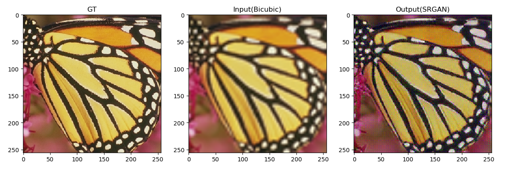

# PyTorch SRGAN
Implementation of Paper: "Photo-Realistic Single Image Super-Resolution Using a Generative Adversarial Network"(https://arxiv.org/abs/1609.04802) in PyTorch

## Usage
### Training
```
usage: main_srgan.py [-h] [--batchSize BATCHSIZE] [--nEpochs NEPOCHS]
                     [--beta1 BETA1] [--lr LR] [--step STEP] [--cuda]
                     [--resume RESUME] [--start-epoch START_EPOCH]
                     [--threads THREADS] [--pretrained PRETRAINED]
                     [--clamp CLAMP] [--gpus GPUS]

optional arguments:
  -h, --help            show this help message and exit
  --batchSize BATCHSIZE
                        training batch size
  --nEpochs NEPOCHS     number of epochs to train for
  --beta1 BETA1         beta1 for adam. default=0.5
  --lr LR               learning rate, default=0.0001
  --step STEP           Sets the learning rate to the initial LR decayed by
                        momentum every n epochs, Default: n=500
  --cuda                Use cuda?
  --resume RESUME       Path to checkpoint (default: none)
  --start-epoch START_EPOCH
                        Manual epoch number (useful on restarts)
  --threads THREADS     Number of threads for data loader to use, Default: 1
  --pretrained PRETRAINED
                        path to pretrained model (default: none)
  --clamp CLAMP
  --gpus GPUS           gpu ids (default: 0)

```
An example of training usage is shown as follows:
```
python main_srgan.py --cuda --gpus 0
```

### demo
```
usage: demo.py [-h] [--cuda] [--model MODEL] [--image IMAGE]
               [--dataset DATASET] [--scale SCALE] [--gpus GPUS]

optional arguments:
  -h, --help         show this help message and exit
  --cuda             use cuda?
  --model MODEL      model path
  --image IMAGE      image name
  --dataset DATASET  dataset name
  --scale SCALE      scale factor, Default: 4
  --gpus GPUS        gpu ids (default: 0)
```
We convert Set5 test set images to mat format using Matlab, for simple image reading
An example of usage is shown as follows:
```
python demo.py --model model/model_srgan.pth --dataset Set5 --image butterfly_GT --scale 4 --cuda
```

### Eval
```
usage: eval.py [-h] [--cuda] [--model MODEL] [--dataset DATASET]
               [--scale SCALE] [--gpus GPUS]

optional arguments:
  -h, --help         show this help message and exit
  --cuda             use cuda?
  --model MODEL      model path
  --dataset DATASET  dataset name, Default: Set5
  --scale SCALE      scale factor, Default: 4
  --gpus GPUS        gpu ids (default: 0)
```
We convert Set5 test set images to mat format using Matlab. Since PSNR is evaluated on only Y channel, we import matlab in python, and use rgb2ycbcr function for converting rgb image to ycbcr image. You will have to setup the matlab python interface so as to import matlab library. 
An example of usage is shown as follows:
```
python eval.py --model model/model_srgan.pth --dataset Set5 --cuda
```

### Prepare Training dataset
  - Please refer [Code for Data Generation](https://github.com/twtygqyy/pytorch-SRResNet/tree/master/data) for creating training files.
  - Data augmentations including flipping, rotation, downsizing are adopted.

### Performance
  - We provide a pretrained model trained on [291](http://cv.snu.ac.kr/research/VDSR/train_data.zip) images with data augmentation
  - Instance Normalization is applied instead of Batch Normalization for better performance
  
| Dataset   | SRResNet PyTorch| SRGAN PyTorch|
| ----------|:---------------:|:------------:|
| Set5      | **31.52**       |    **22.27** |
| Set14     | **27.95**       |    **20.81** |
| BSD100    | **27.17**       |    **20.42** |

### Result
From left to right are ground truth, bicubic and SRGAN, the result for SRGAN still has significant artifacts and checkerboard issues, any suggestion is welcome
<p>
  
</p>